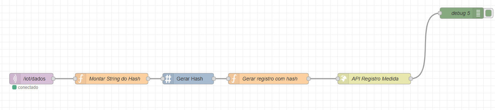
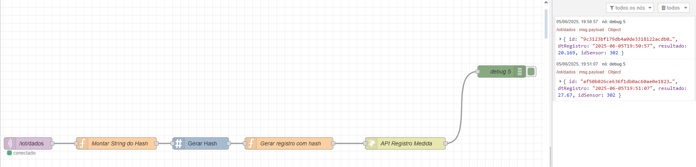

# $FonteViva – Estação-IoT-Autônoma$

Solução voltada ao **monitoramento de recursos hídricos** em cenários de risco e emergência, utilizando sensores físicos, rede MQTT e persistência em banco de dados Oracle via API.


> Uma solução integrada para o armazenamento, reaproveitamento e tratamento inteligente da água, com controle remoto e análise de qualidade em tempo real.

## **Sobre o Projeto**

O **FonteViva** é uma mini estação de tratamento de água projetada para ser portátil, empilhável e de rápida instalação, atuando tanto em cenários de escassez quanto de excesso de água. Ela integra tecnologias sustentáveis, IoT e energia solar para garantir autonomia e eficácia.

### _Componentes do Sistema_

- **Tanque superior:** Armazena água bruta (capacidade: 30–40L)
- **Filtro por gravidade:** Com carvão ativado e camadas filtrantes
- **Controle eletrônico:**
  - Medição de pH, turbidez, temperatura e volume
  - Luz UV para controle microbiológico
  - Comunicação via rede local (MQTT ou HTTP)
- **Energia limpa:** Painel solar alimentando sensores e sistema

### _Estimativa de Custos da Estação FonteViva_

| Item                                   | Descrição                           | Estimativa (R\$) |
| -------------------------------------- | ----------------------------------- | ---------------- |
| Tanque plástico                        | Reservatório superior de água (40L) | R\$ 50,00        |
| Filtro por gravidade                   | Camadas de cascalho, areia e carvão | R\$ 60,00        |
| Sensor de pH                           | Medição da acidez                   | R\$ 45,00        |
| Sensor de turbidez                     | Verifica partículas em suspensão    | R\$ 40,00        |
| Sensor de temperatura                  | Monitoramento térmico da água       | R\$ 30,00        |
| Sensor de nível (ultrassônico)         | Medição de volume disponível        | R\$ 50,00        |
| Módulo UV (esterilização)              | Controle de micro-organismos        | R\$ 70,00        |
| ESP32 / ESP8266                        | Microcontrolador com Wi-Fi          | R\$ 35,00        |
| Módulo MQTT / rede local               | Comunicação dos dados               | R\$ 10,00        |
| Painel solar + controlador + bateria   | Energia limpa e sustentável         | R\$ 150,00       |
| Estrutura física (bomba, tubos, caixa) | Instalação e vedação                | R\$ 90,00        |
| Total estimado por unidade             |                                     | **\~R\$ 630,00** |

> Valores podem reduzir com a parceria de fornecedores.

### _Viabilidade_

A proposta é financeiramente acessível, de fácil transporte (empilhável como copos plásticos) e utiliza energia limpa. Ideal para contextos de emergência, comunidades isoladas ou educação ambiental.

### _Visão Geral da Solução_

A arquitetura implementada conecta um protótipo físico (ESP32) com sensores ambientais a um sistema de backend em nuvem, garantindo:

- Coleta de dados em tempo real
- Envio via MQTT (Mosquitto)
- Processamento no Node-RED
- Persistência via API RESTful em banco Oracle

---

## **Componentes da Solução**

### 1. _API para integração com Banco de Dados_

A API está implementada em ASP.NET, hospedada em ambiente cloud (Azure), e expõe um endpoint do tipo `POST` para registro das leituras recebidas.

[Repositório da API no GitHub](#) _(em breve)_

---

### 2. _Containers Docker na Azure_

Na VM Linux, são executados dois containers fundamentais:

#### Mosquitto (Broker MQTT)

- **Broker:** `mqtt://104.41.50.45:1883`
- **Tópico de publicação:** `/iot/dados`
- **QoS:** 0

#### Node-RED (Integração HTTP)

O Node-RED atua como middleware entre o protótipo e a API, recebendo os dados via MQTT, formatando e entregando para o backend via HTTP.

#### Funções aplicadas no fluxo:

- Geração de hash de ID único (SHA256)
- Montagem do payload JSON
- Envio por HTTP `POST`



---

### 3. _Protótipo IoT com ESP32_

O protótipo simula uma estação autônoma equipada com sensores de:

- pH
- Temperatura
- Vazão

Os dados são lidos, formatados em JSON e enviados via MQTT para o broker Mosquitto.

#### Exemplo de dados simulados:

```json
{
  "dtRegistro": "2025-06-05T16:41:00",
  "resultado": 7.86,
  "idSensor": 301
}
```

---

## **Persistência de Dados**

Ao receber a mensagem MQTT, o Node-RED:

1. Gera o campo `"id"` como um hash SHA256 entre `idSensor + dtRegistro`
2. Monta o JSON final:

```json
{
  "id": "57975394715f72b8078d8f3457d1622415210cc577d62f0f2f5e1e5d4d476b10",
  "dtRegistro": "2025-06-05T16:41:00",
  "resultado": 8.486,
  "idSensor": 301
}
```

3. Realiza o envio para a API via HTTP `POST`
4. Recebe resposta de sucesso (`200 OK`) confirmando o armazenamento



---

## **Resultado**

- Comunicação IoT validada com dados simulados
- Containers Docker funcionais
- Persistência ativa em Oracle via API
- Infraestrutura simulada para cenários críticos
- Modular e escalável


 